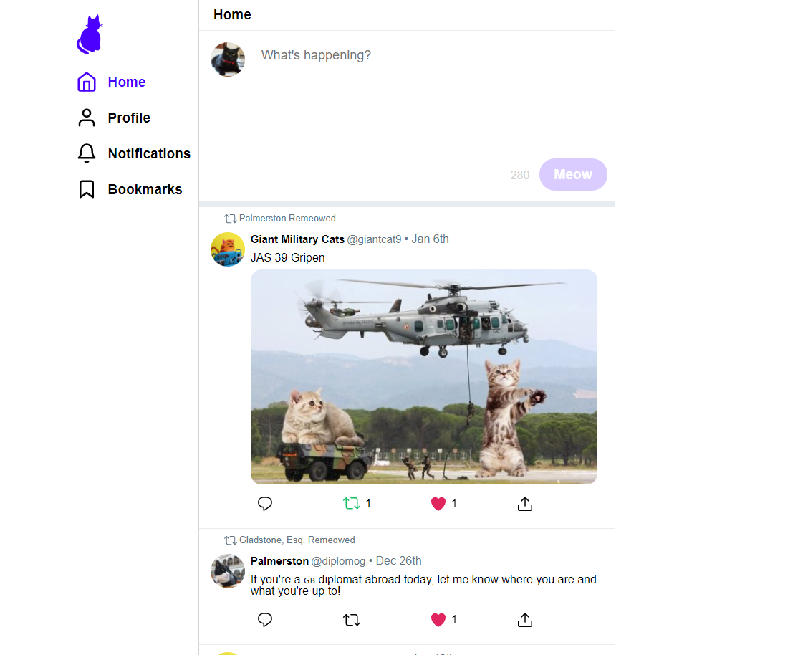
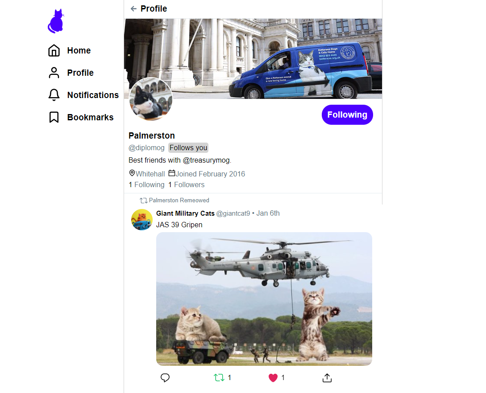
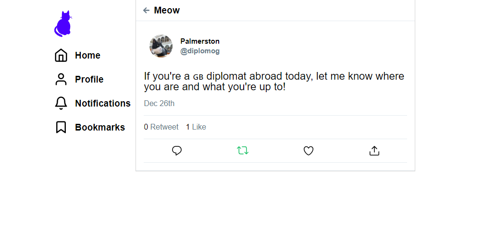
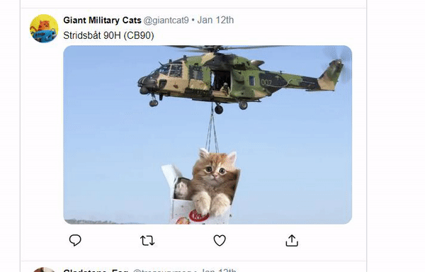
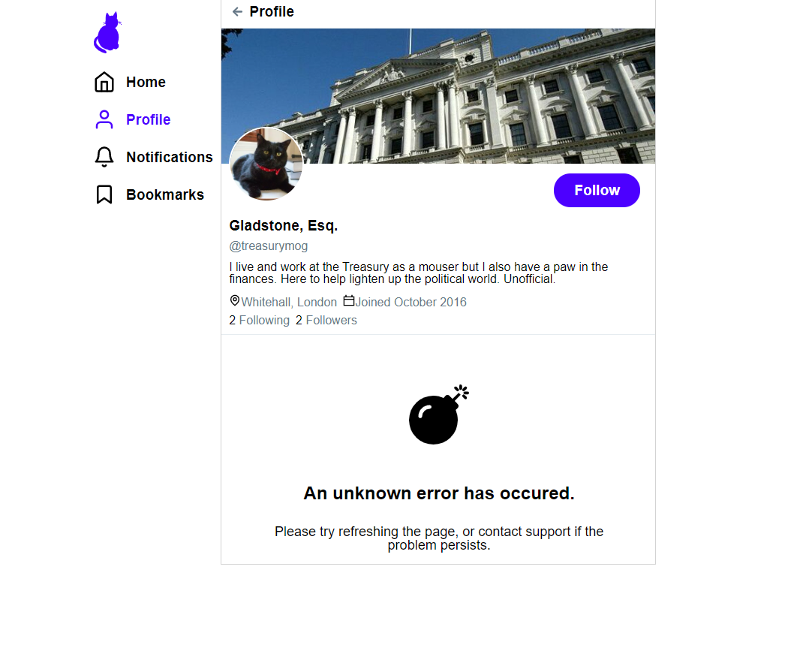

# Twitter clone project

This project is a replica of the site Twitter, now called Critter. This was my first time using React, it was a nice little introduction to the technology. The back-end server was done using Node.js, and contacted an API given to me by my boot camp instructor, which has all the data for all the tweets and all the users.

---

## Features

### Critter Feed Page

Home page to view all the 'meows' of other users that they follow.

### Profile Page

A profile page to see all of a specific user's 'meows'.

### Detailed 'Meow' page

A page to see a Meow in more detail.

### Liking and retweeting

A user can like or retweet any 'meow' by pressing on the respective buttons.

### Error message

An error message which displays when the back-end server returns an error (5% of the time, done on purpose).
